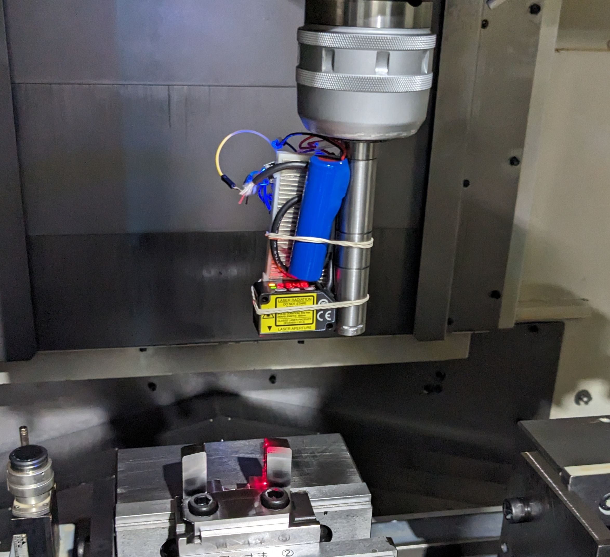

On September 26, 2023, we had our first demo day. We demonstrated the following:
- Run on the machine
- Detect the edge of the part
- Stream the sensor data to the software

<!--truncate-->

## Method
1. Set up the parts and connect it to the machine
2. Move the sensor manually and monitor the data and identify the edge
3. Check the edge coordinates and measure the dimension 

## Results

| Estimated | Answer | Difference |
| --- | --- | --- |
| 35.925 | 36.07 | 0.145 |
(All in mm)

Our goal is to achieve an accuracy of 10µm, so we are still far from our goal. We will continue to work on improving the accuracy.

## Next Steps

- Get the coordinate of the tool and synchronize it with the sensor data
- Improve the accuracy of the sensor
- Automate the process