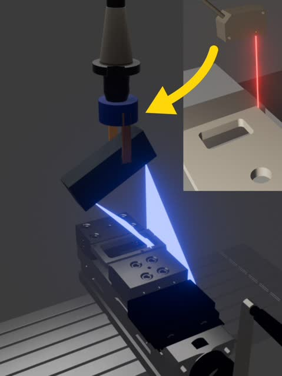

We are switching to a 3D scanner from a laser triangulation sensor for the on-machine CMM system because that would be just a cheaper and less accurate alternative for existing touch probe products. 
In this blog post, we will explain the reasons why 3D scanners are better for our target customers.

<!--truncate-->

## Issues with Laser Triangulation Sensor
Initially, we considered attaching a laser triangulation sensor as the main axis instead of a touch probe. However, as the functionality and specifications were no different from those of a touch probe, we determined that it would not be an attractive product for customers.
In particular, the following issues are the main challenges for adoption:

- Wiring of the CNC machine needs to be changed
- CAD data is required

### Wiring of the CNC Machine
A touch probe sends a signal to the CNC machine the moment the stylus touches the workpiece, enabling measurement of its position. 
As a result, wiring to the CNC machine's PLC is required.
In the measurement using the laser triangulation sensor developed by our company, similar wiring changes were required, 
and, it was extremely difficult for customers to change the wiring themselves or consult with the manufacturer for wiring changes, which became an obstacle to adoption.
Additionally, to obtain coordinate data stored in variables, you have to use the DPRNT command, which increases complexity.
Since specifications vary for each CNC machine, it was expected that development costs would also be huge due to these points.

### Need for CAD Data
Both touch probes and laser triangulation sensors require CAD data for measurement.
It is necessary to know in advance which part of the workpiece of what shape is to be measured.
Even if the software is made easy to use, it will not function at all if there is no CAD data.

## Advantages of 3D Scanner
Taking these challenges into account, we decided to adopt a 3D scanner.
This method involves measuring the workpiece by rotating the 3D scanner as the main axis.
This approach has the following advantages:

- No need to change the wiring of the CNC machine
- No need for CAD data

### No Need to Change the Wiring of the CNC machine
As 3D scanners do not require acquisition of coordinate data from the CNC machine, measurement of the workpiece is possible without changing the wiring.
This means that this product can support any CNC machine regardless of the manufacturer or model.

### No Need for CAD Data
3D scanners scan the shape of the workpiece, eliminating the need for CAD data.
Therefore, even if there is no CAD data, measurement is possible, such as when programmed interactively.

:::note Disadvantages of 3D Scanner
A disadvantage of 3D scanners is that it is very difficult to achieve high-precision measurements like those of touch probes, ±1µm.
However, since our product is intended for general tolerance measurement, this drawback is not a significant issue.
Although prototyping is still underway, we believe that even with a 3D scanner, measurements with an accuracy of around ±50µm are possible.
:::