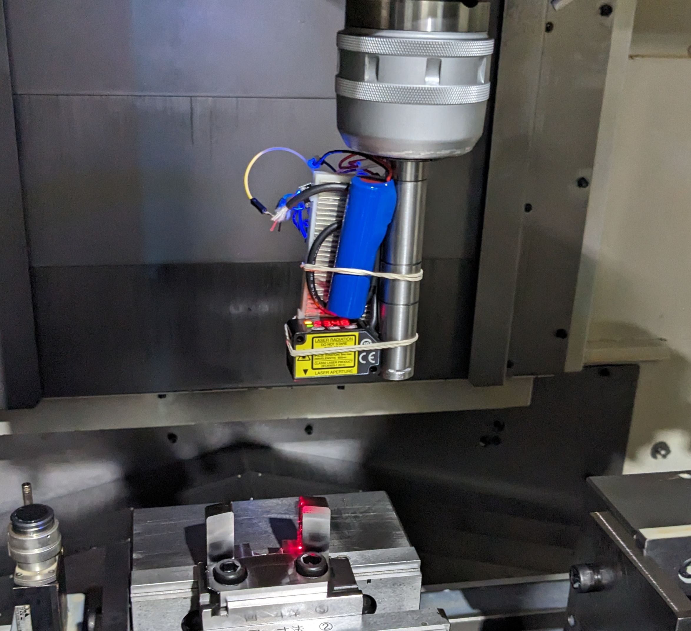

2023年9月26日, 初めて試作品でテストしました。これにより以下のことが分かりました。
 - マシニングセンタ内でで正常に動作
 - 部品の端を検出
 - センサーデータを機外のパソコンに送信

<!--truncate-->

## 方法
1. 部品をセットアップして、マシンに接続します
2. センサーを手動で移動し、データを監視し、エッジを識別します
3. エッジ座標を確認し、寸法を測定します

## 結果

| 推測値 | 実際の値 | 差 |
| --- | --- | --- |
| 35.925 | 36.07 | 0.145 |
(単位は全てmm)

私たちの目標は、10µmの精度を達成することです。まだ目標からはほど遠いですが精度の向上に引き続き取り組みます。

## 次に向けて

- マシニングセンタから座標を取得しセンタと同期させる
- センサの精度を上げる
- 自動で測定できるようにする