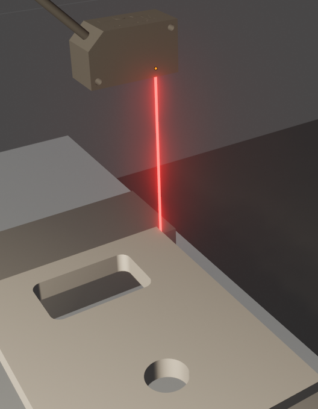

1週間前、10月6日にマシニングセンタから座標データを取得する方法をついに見つけました。

<!--truncate-->

## なぜ座標データが必要なのか？
機内測定のCMMシステムを開発しています。
基本的に、レーザー距離センサーをスピンドルに置き、センサーとワークの間の距離を測定します。
センサーを移動すると、センサーデータを監視することでワークの端を検出できます。
ただし、センサのデータを活用するためにはマシニングセンタから軸座標を取得する必要があります。

結局**MTConnect**で軸座標を取得できました。

マシニングセンタから軸の位置を取得する方法を見つけるのに2か月以上かかりました。
1日目から軸座標を取得する必要があることがわかっていたので、最初に業界標準規格のMTConnectを調べるべきでした。

## 試したこと
振り返ってみると大変的外れではありますが、MTConnectを見つける前に試したプロトコルのリストは次のとおりです。
- I2C
- UART
- MSMQ (Microsoft Message Queuing)
- データベース

CNCにはシリアルポートがあるため、シリアルポートから軸位置を取得できると思いました。 Gコードファイルを送信および受信するための単なるインターフェイスであることが判明しました。
ロジックアナライザーを使用して、シリアルポートで何が起こっているのかを確認しましたが、データは見つかりませんでした。
次に、MSMQを使用してマシニングセンタからコンピューターへのデータを受信しようとしましたが、機能しませんでした。

最後に、データベースを使用して軸データを保存しようとしましたが、それらしきデータは一切ありませんでした。
幸いなことに、途中で、マシニングセンタに外部からアクセスする方法を見つけました。
これにより調査しやすくなっただけでなく、より効率よくプログラムを作成することができるようになりました。

マシニングセンタでいくつかのフォルダーを閲覧していたとき、「MTConnect」というフォルダーを見つけて、それについていくつかの調査を行いました。
次に、MTConnectはマシニングセンタからデータを取得するためのプロトコルであり、そのデフォルトのポート7878が開いていることがわかりました。
ubuntuサーバーにMTConnectエージェントをインストールし、ドキュメントを参照してagent.cfgおよびdevices.xmlファイルを作成しました。
次に、Metastudio（Mtconnect Explorer）を使用してマシニングセンタから軸データを見つけることができました。

MTConnectの詳細については、[docs](/ja/docs/tutorial-basics/mtconnect)を参照してください。
