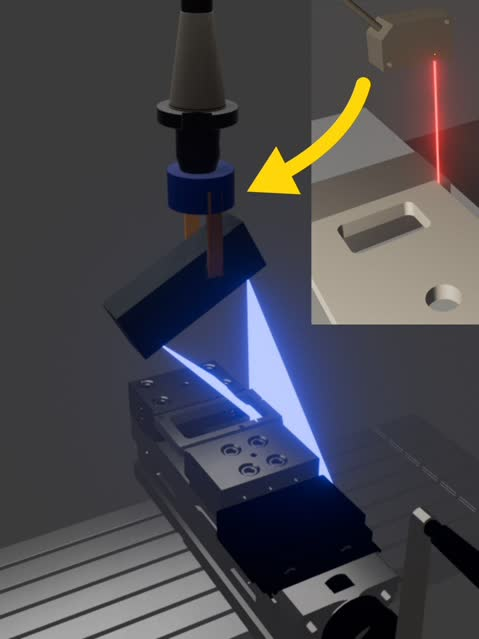

予定を変更し、レーザー変位センサで機内測定をする製品を開発していましたが、既存のタッチプローブ製品よりも安価で精度が低い代替品になるだけだと判断し、
3Dスキャナーに切り替えることにしました。このブログ記事では、なぜ3Dスキャナーの方が顧客にとってよりよい製品であるのかについて説明します。

<!--truncate-->

## レーザー変位センサの問題点
当初タッチプローブの代わりにレーザー変位センサを主軸に取り付けることを検討していましたが、機能や仕様などがタッチプローブとなんら変わらないため、顧客にとって魅力的な製品にはなりえないと判断しました。
特に導入にあたり、以下の問題がありました。
- マシニングセンタの配線を変更が必須
- CADデータが必要

### マシニングセンタの配線を変更が必須
タッチプローブはスタイラスがワークに接触した瞬間にマシニングセンタに信号を送り、その位置を測定します。
このため信号を送るためのマシニングセンタの基盤への配線工事が必要となります。
当社で開発していたレーザー変位センサと用いた測定においても同様で顧客側で配線を変更する、またはメーカーに相談し配線していただくことは非常に困難であり、導入の妨げになってしまいます。
それだけでなく、信号をマシニングセンタに送り変数に保存された座標データを取得するためにDPRNTコマンドを使用する必要があります。
こうした点は各マシニングセンタごとに仕様が変わるため、開発のコストもかかることが予想されました。

### CADデータが必要
またタッチプローブ、レーザー変位センサともに測定にはCADデータが必要です。
どのような形状のワークのどの部分を測定するのかを事前に知る必要があります。
どれだけソフトウェアを簡単に使いやすくしたとしてもCADデータがない場合は一切機能しないという問題があります。

## 3Dスキャナーの利点
こうした課題を踏まえ、3Dスキャナーを採用することにしました。
3Dスキャナーを主軸で回転させることでワークの測定をするという方法です。
この方法には以下の利点があります。
- マシニングセンタの配線を変更が不要
- CADデータが不要

### マシニングセンタの配線を変更が不要
3Dスキャナーはマシニングセンタから座標のデータを取得する必要がないため配線を変更することなく、ワークの測定が可能です。
これによりマシニングセンタのメーカーやモデルに依存することなく、導入が可能となります。

### CADデータが不要
3Dスキャナーはワークの形状をスキャンするため、CADデータが不要です。
そのため、対話型でプログラムした場合など、CADデータがない場合でも測定が可能です。

:::note 3Dスキャナーの欠点
3Dスキャナーではタッチプローブのような±1µmといった高精度な測定は非常に困難であるというデメリットがあります。
しかし、当社の製品は一般公差の測定を目的としているため、このデメリットはあまり問題にはなりません。
試作はこれからではありますが、３Dスキャナーであっても±50µm程度の精度で測定が可能であると考えています。
:::