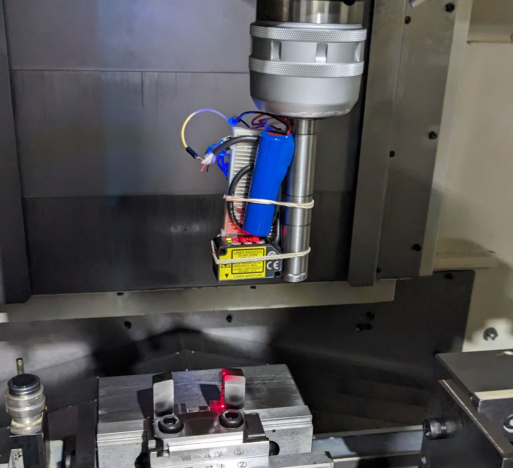

2023年9月26日，我们举办了第一个演示日。我们证明了以下内容：
- 在机器上运行
- 检测零件的边缘
- 将传感器数据传输到软件

<!--truncate-->

## 方法
1. 设置零件并将其连接到机器
2. 手动移动传感器并监视数据并确定边缘
3. 检查边缘坐标并测量尺寸

## Results

|估计|答案|差异|
| --- | --- | --- |
| 35.925 | 36.07 | 0.145 |
（全部以毫米）

我们的目标是实现10µm的准确性，因此我们离目标仍然很远。我们将继续致力于提高准确性。

##  下一步
- 获取工具的坐标并将其与传感器数据同步
- 提高传感器的准确性
- 自动化过程